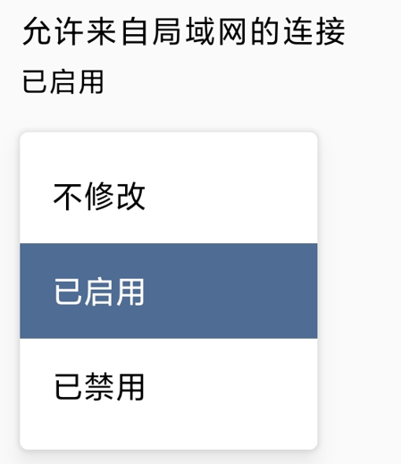
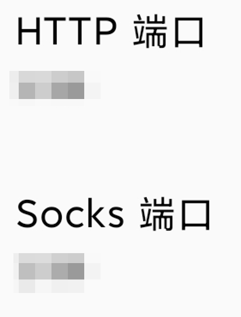
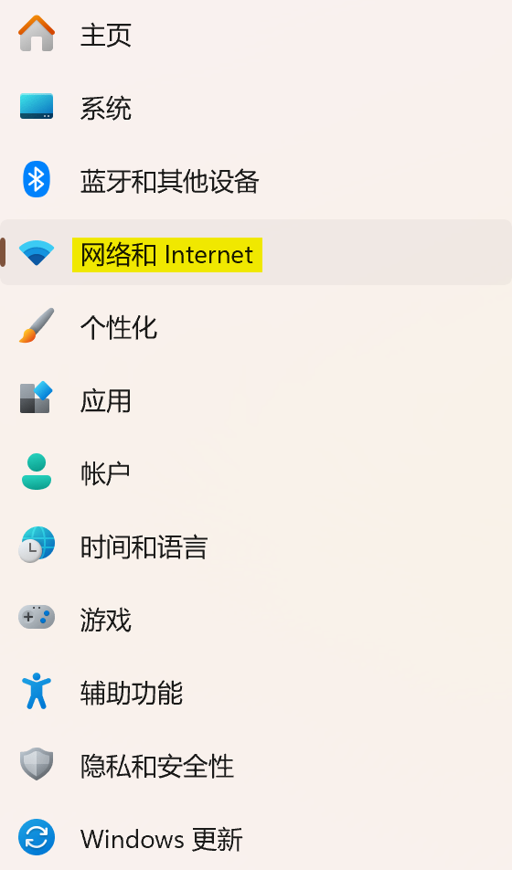
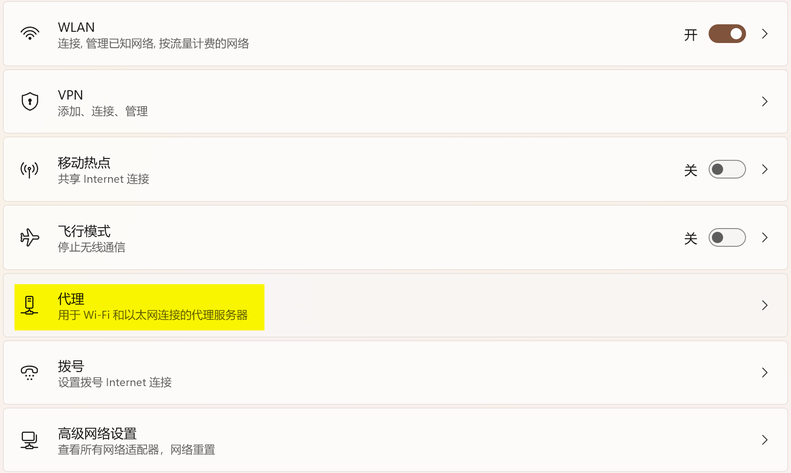
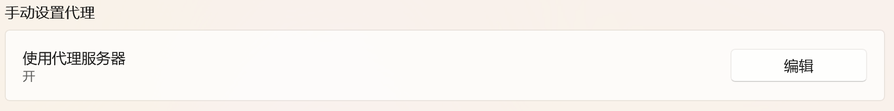
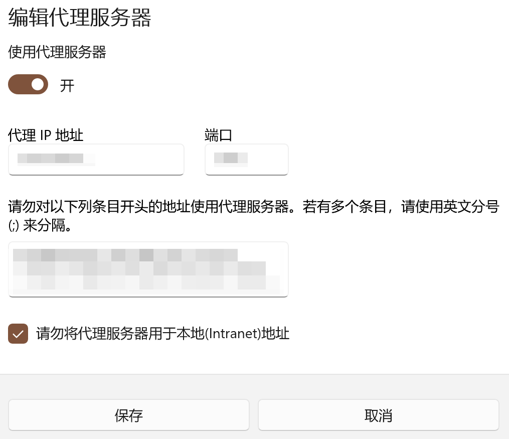

# 技术指南：Windows 电脑使用 Android VPN 热点（Tech Guide: Android VPN Hot Spots for Windows PCs）

## 说明（Note）

本文的主要受众是中国人，我懒于去精校英文部分，所以我只翻译我确定的部分。

The main audience of this article is Chinese, and I'm too lazy to fine-tune the English parts, so I'll only translate the parts I'm sure of.

## 背景（Background）

手机在连接到VPN并可以访问网站后，如果直接打开热点共享给电脑或者其他设备，其他设备连接后大概率是无法直接访问网站的。如何做进一步的配置呢？本文以 Windows 11 为例，手机端软件为 Clash Meta for Android，演示如何配置代理。

After the phone is connected to the VPN and can access the website, if you directly open the hotspot sharing to the computer or other devices, the other devices are connected and the probability is that they can't access the website directly. How to do further configuration? In this article, we take Windows 11 as an example and Clash Meta for Android as the software on the cell phone to demonstrate how to configure the proxy.

手机初始条件：连接了WLAN，开启了可用的VPN。

Initial conditions for the phone: WLAN is connected and an available VPN is turned on.

### 1. 手机端配置方法：

1.1. 打开`设置`（Open `Settings`）

1.2. 打开`覆写`

1.3. 启用`来自局域网的连接`

1.4. 自定义`HTTP端口`和`Socks端口`，如四位数字。

1.5. 进入自己连接的WLAN界面，查看`IP地址`并记录。需要记录的IP地址的格式为`数字.数字.数字.数字`（Go to the Wi-Fi screen you are connected to, check the `IP address`, and record it. The IP address that needs to be recorded is in the format `Number.Number.Number.Number`）

### 2. 电脑端的配置方法

2.1. 打开`网络和Internet`

2.2. 进入`代理`

2.3. 编辑`手动代理设置`

2.4. 打开`使用代理服务器`，输入您的`IP地址`以及`端口号`

保存。

### 3. 回到手机(Back to the Phone)

重新启动 Clash Meta for Android 的节点。

Restart the Clash Meta for Android node.

---

至此，如果手机的节点可用，那么电脑也就可以访问网页了。

Now, if the phone node is available, the computer can access the web.